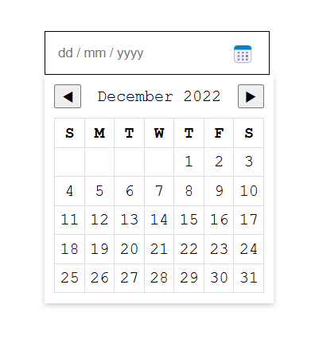

# Date Picker UI 🎨📅

A simple static **Date Picker UI** built using **HTML and CSS**, designed to look like a traditional date picker but without JavaScript functionality.

## ✨ Features
- 📌 Simple input with a placeholder (`dd / mm / yyyy`).
- 📅 A calendar-like dropdown UI.
- 🔘 Button with a calendar icon.
- 🎯 Absolutely positioned date picker element.
- 🎨 Fully styled with **CSS** (no Bootstrap, no JavaScript).

## 📷 Preview
  

## 📂 Folder Structure
